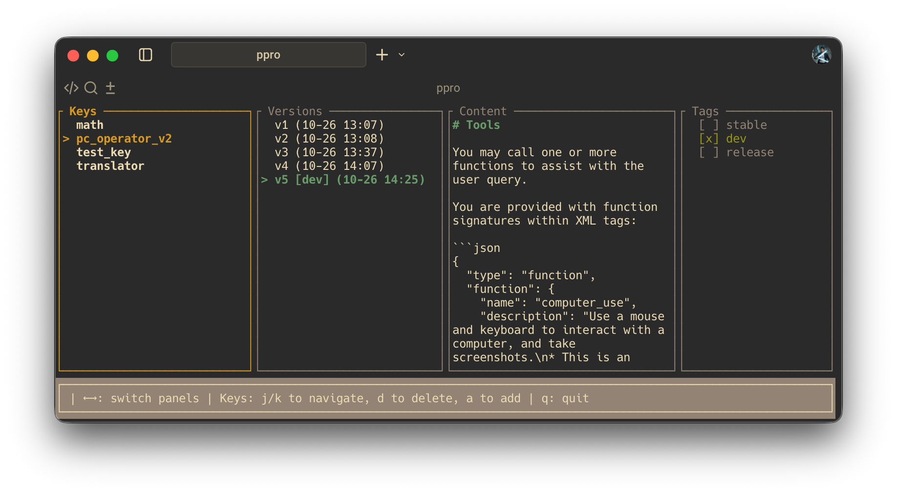

# PromptPro🚀: Advanced Prompt Manage and Versioning System


**Promptpro** is a powerful, flexible, and developer-friendly prompt management system that transforms how you create, manage, and version AI prompts. Designed for prompt engineers, AI developers, and serious AI enthusiasts, it combines speed, security, and usability in one elegant tool.

With built-in versioning, tagging, encryption, and a sleek TUI interface, Promptpro eliminates the chaos of multi-file JSON/YAML management across projects. Reference prompts with a unique key, and every change is automatically tracked—no manual versioning required.

Under the hood, Promptpro is powered by Rust 🦀, giving you lightning-fast performance while maintaining seamless Python integration. It supports both Python and Rust out of the box, so you can use your prompts in **any language, any project, anywhere.**

```py
pip install promptpro
```

then,

Your chaos prompt can be easily use like this (note, any project, any language):

```py
from promptpro import PromptManager

pm = PromptManager("promptpro.vault", "")
a = pm.get_prompt("pc_operator_v2", "dev")
print(a)
# you are a super helpful computer use assistant...
```

That's all! You got speed and security, also fastest prompt development.


Easily track each changes of your prompt, never lose and keeping organized.


## ✨ Key Features

- 🔐 **Secure Vault**: Optional password-encrypted vault dumps for sensitive prompt data
- 📦 **Complete Backup**: Full vault export/import functionality with binary format
- 🔄 **Automatic Versioning**: Every prompt change is automatically versioned
- 🏷️ **Smart Tagging**: Tag versions with "dev", "stable", "release", and custom tags
- 💻 **Beautiful TUI**: Intuitive terminal user interface for easy navigation
- 📝 **Rich History**: Track all changes with timestamps and optional messages
- ⚡ **Blazing Fast Performance**: Optimized storage with efficient retrieval (powered by Rust)
- 🛠️ **Developer Friendly**: Comprehensive CLI and library API

## 🚀 Quick Start

### Installation

Python:

```shell
pip install promptpro
```

Rust:

```shell
cargo install promptpro
```

Install from source:

```bash
# Clone the repository
git clone https://github.com/lucasjinreal/promptpro
cd promptpro

./install.sh
```



### Basic Usage

`ppro` is the short form of `promptpro`. after `install.sh` it will available in your path.

```bash
# Add a new prompt
echo "Write a poem about technology" | ppro add

# Add with a key
ppro add "You are a helpful AI assistant"

# Update an existing prompt
ppro update my-prompt "You are a super helpful AI assistant"

# Get the latest version
ppro get my-prompt

# Get a specific version or tag
ppro get my-prompt 2
ppro get my-prompt stable

# Tag a version
ppro tag my-prompt stable 1

# Show history
ppro history my-prompt

# Open the TUI interface
ppro tui
```

## 📦 Backup & Restore

### Export Your Vault

```bash
# Export without encryption (unencrypted binary)
ppro dump prompts.vault

# Export with password encryption
ppro dump prompts.vault --password "your-secret-password"
```

### Import Your Vault

```bash
# Import unencrypted vault
ppro resume prompts.vault

# Import encrypted vault
ppro resume prompts.vault --password "your-secret-password"
```

## 🎮 TUI Interface

Navigate your prompts with the intuitive terminal interface:

- **Arrow Keys / hjkl**: Navigate between panels and items
- **← →**: Switch between the 4 columns (Keys, Versions, Content, Tags)
- **Enter / x**: Apply or toggle tags on selected versions
- **e**: Edit content in the current panel
- **o**: Open external editor (like vim, nano)
- **q**: Quit the application
- **Ctrl+S**: Save when in edit mode

## 🔧 Advanced CLI Commands

### Tag Management

```bash
# Tag a specific version
ppro tag my-prompt stable 1

# Promote a tag to the latest version
ppro promote my-prompt stable

# The 'dev' tag is automatically promoted to latest version on updates
```

### History & Retrieval

```bash
# Show full history for a prompt
ppro history my-prompt

# Get prompt to a file
ppro get my-prompt --output my-file.txt

# Get specific version
ppro get my-prompt 3

# Get by tag
ppro get my-prompt stable
```

## 🛠️ Programmatic API Usage

ppro can be easily integrated into both Rust and Python applications.

### Rust API

#### Add to Cargo.toml

```toml
[dependencies]
promptpro = { path = "path/to/promptpro" }  # or git source
```

#### Basic Rust API Example

High level, write a PromptManager singleton:

```rust
use anyhow::Result;
use once_cell::sync::Lazy;
use promptpro::{PromptVault, VersionSelector};
use std::sync::Arc;
use tokio::sync::RwLock;

// Our global PromptManager singleton
pub struct PromptManager {
    vault: Arc<RwLock<PromptVault>>,
}

// Static global instance
static MANAGER: Lazy<PromptManager> = Lazy::new(|| {
    let vault = PromptVault::restore_or_default("./promptpro.vault", None)
        .expect("Failed to open PromptPro default vault");
    PromptManager {
        vault: Arc::new(RwLock::new(vault)),
    }
});

impl PromptManager {
    pub fn get() -> &'static Self {
        &MANAGER
    }

    pub async fn get_prompt(&self, key: &str, selector: VersionSelector<'_>) -> Result<String> {
        let vault = self.vault.read().await;
        Ok(vault.get(key, selector)?)
    }

    pub async fn latest(&self, key: &str) -> Result<String> {
        self.get_prompt(key, VersionSelector::Latest).await
    }
}

// Use

let pm = PromptManager::get();
let prompt = pm
    .get_prompt("pc_operator_v2", VersionSelector::Tag("dev"))
    .await
    .map_err(|e| AgentBuildError::PromptError(e.to_string()))?;
```

Low level API:

```rust
use ppro::{PromptVault, VersionSelector};

// Open the default vault
let vault = PromptVault::open_default()?;

// Add a new prompt
vault.add("greeting", "Hello, World!")?;

// Update an existing prompt
vault.update("greeting", "Hi there!", Some("Updated greeting".to_string()))?;

// Get latest version
let content = vault.get("greeting", VersionSelector::Latest)?;

// Tag a version
vault.tag("greeting", "stable", 1)?;

// Get by tag
let stable_content = vault.get("greeting", VersionSelector::Tag("stable"))?;

// Get history
let history = vault.history("greeting")?;
```

#### Backup & Restore API (Rust)

```rust
use ppro::PromptVault;

// Dump vault to binary file (with optional encryption)
let vault = PromptVault::open_default()?;
vault.dump("backup.vault", Some("my_password"))?;

// Or without encryption
vault.dump("backup.vault", None)?;

// Restore from binary file
let restored_vault = PromptVault::restore("backup.vault", Some("my_password"))?;
```

#### Complete Rust Example Program

```rust
use ppro::{PromptVault, VersionSelector};
use anyhow::Result;

#[tokio::main]
async fn main() -> Result<()> {
    let vault = PromptVault::open_default()?;

    // Add a prompt
    vault.add("summarization", "Summarize the following text concisely...")?;
    
    // Update with improvements
    vault.update("summarization", 
        "Provide a concise summary of the following text. Focus on key points and maintain context.",
        Some("Improved summarization prompt".to_string()))?;
    
    // Tag as stable
    vault.tag("summarization", "stable", 1)?;
    
    // Get the latest version
    let latest = vault.get("summarization", VersionSelector::Latest)?;
    println!("Latest prompt: {}", latest);
    
    // Get the stable version
    let stable = vault.get("summarization", VersionSelector::Tag("stable"))?;
    println!("Stable prompt: {}", stable);
    
    // Show history
    let history = vault.history("summarization")?;
    for version in history {
        println!("Version {}: ({}) {:?}",
            version.version, 
            version.timestamp.format("%Y-%m-%d %H:%M"),
            version.tags
        );
    }

    // Backup the vault
    vault.dump("backup.vault", Some("secure_password"))?;
    println!("Vault backed up successfully!");
    
    Ok(())
}
```

## 🐍 Python Bindings

ppro also provides Python bindings built with PyO3, making it easy to integrate prompt management into Python applications.

### Installation

The Python package can be built and installed using Maturin:

```bash
pip install promptpro
```

Or if building from source:

```bash
cd promptpro
maturin build --features python
pip install target/wheels/promptpro-*.whl
```

### Basic Python Usage

```python
from promptpro import PromptManager

pm = PromptManager.get_singleton("promptpro.vault", "")
a = pm.get_prompt("pc_operator_v2", "dev")
print(a)
```


## 🎯 Why Choose ppro?

### For Prompt Engineers

- **Version Control**: Track every iteration of your prompts
- **A/B Testing**: Maintain multiple versions and compare effectiveness
- **Rollback Capability**: Instantly return to previous versions
- **Tag Management**: Organize prompts by stability, project, or context

### For AI Developers

- **API Integration**: Easy programmatic access to your prompts
- **Environment Management**: Different tags for dev/staging/prod
- **Team Collaboration**: Share and sync prompt collections
- **Performance**: Fast retrieval and minimal overhead

### For Security-Conscious Teams

- **Encryption**: Optional password protection for sensitive prompts
- **Binary Format**: Secure, tamper-resistant backup format
- **Local Storage**: Full control over your prompt data
- **Audit Trail**: Complete history with timestamps

## 🏷️ Tagging System

### Special Tags

- **`dev`**: Automatically points to the latest version on updates
- **`stable`**: Manually set for production-ready versions  
- **`release`**: For major releases or milestones

### Custom Tags

You can create any custom tag names to organize your prompts:

```bash
# Create custom tags
ppro tag my-prompt experimental 2
ppro tag my-prompt production-ready 3
ppro tag my-prompt "v2.0" 4
```

## 📊 Use Cases

### AI Model Development

- Track prompt evolution during model training
- A/B test different prompt variations
- Maintain production vs. experimental prompts

### Content Generation

- Template management for marketing campaigns
- Document generation prompts
- Personalized content creation

### Research & Experimentation  

- Maintain experiment logs with associated prompts
- Compare prompt effectiveness across models
- Share prompts within research teams

## 🤝 Contributing

We welcome contributions! Feel free to:

- 🐛 Report bugs and issues
- 💡 Suggest new features
- 🔧 Submit pull requests
- 📖 Improve documentation

## 📄 License

This project is licensed under the GNU General Public License v3.0 (GPL-3.0).

**GPL-3.0 License**:

- You can **freely** use, study, share, and modify this software
- You must **distribute** source code when sharing
- You must **license** derivative works under the same terms
- You must **preserve** the original copyright notice and license

For more details, see the [LICENSE](./LICENSE) file.

---

**ppro** - Taking prompt management to the next level! 🚀

Made with ❤️ for the AI development community.